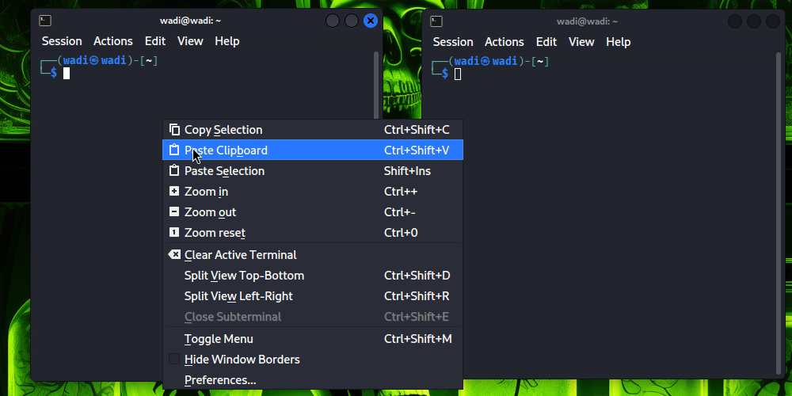

# Smart File Automation 🚀
Python tool to automatically organize your files, folders, and workflows. Save hours every week with one command.

## Why This Exists
We all waste time digging through messy folders. Smart File Automation solves this pain instantly.

## Demo


## Features
- Auto-organize Documents, Images, Videos, and more
- Generate a report of sorted files
- Lightweight and easy to use

## How to U
se
```bash
python3 main.py /path/to/your/folder
## Installation
```bash
git clone https://github.com/howard-dominic/smart-file-automation.git
cd smart-file-automation
pip install -r requirements.txt

Call to Action

⭐ Star this repo if it saved you time!
🐙 Fork & contribute if you want to extend it.
License

MIT License
